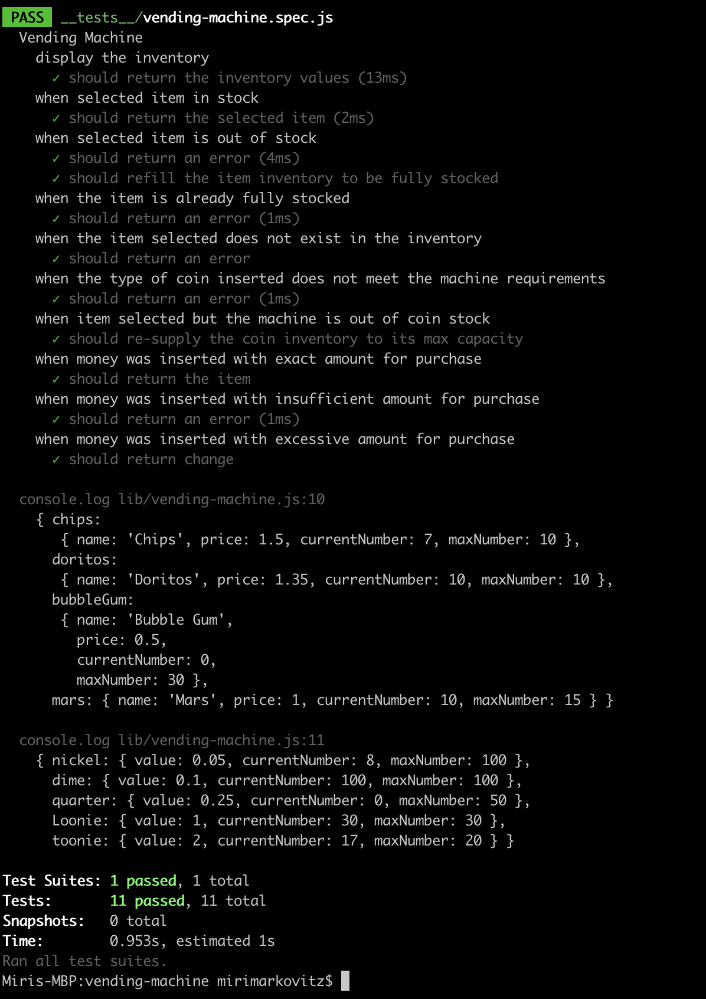

# Vending Machine

## Description
This project is a coding interview challenge which implements a vending machine using JavaScript with no interface and tests to prove it dipenses items, refills inventory and resupplies change.  

## Screenshot



## Technologies Used 
* JavaScript
* Jest

## Personal learnings

TDD (Test Driven Development)- 
* Learned how to test code before writing the code itself.
* Learned Jest syntax.

## Instructions

```bash
npm install
```
```bash
npm t
```